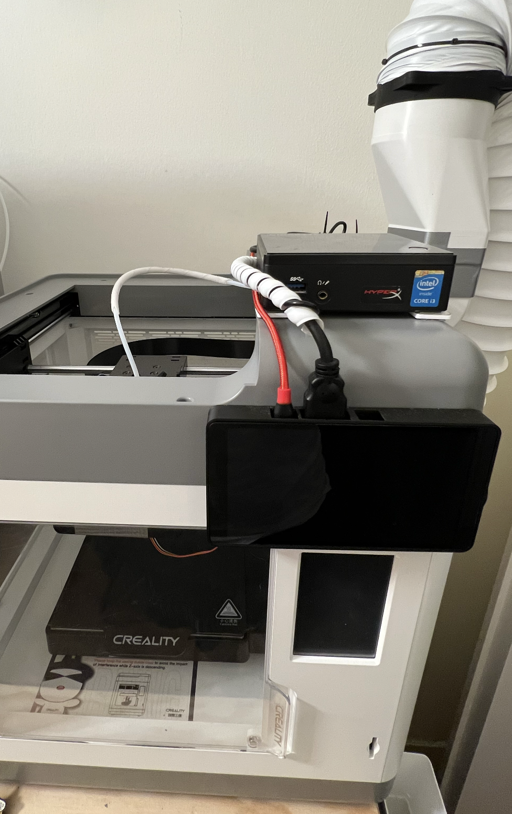
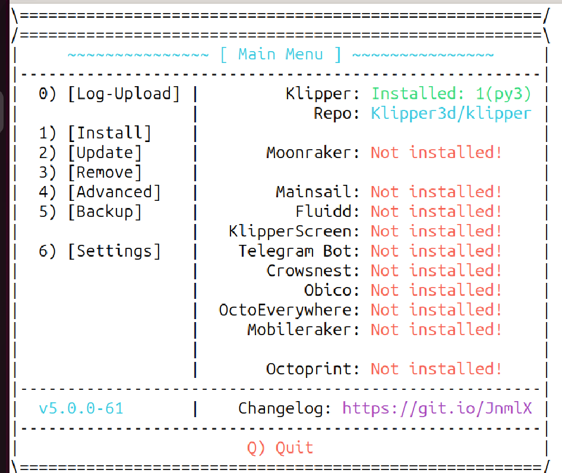
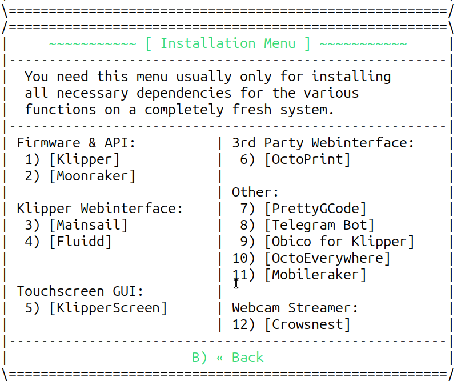
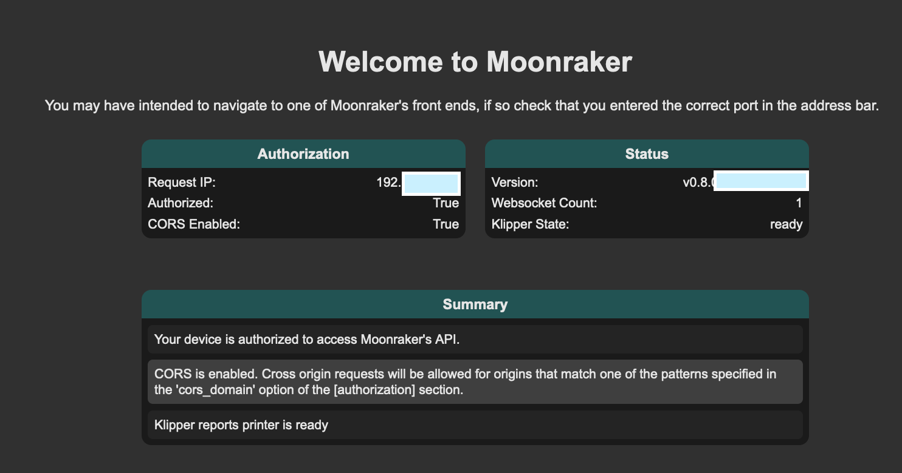
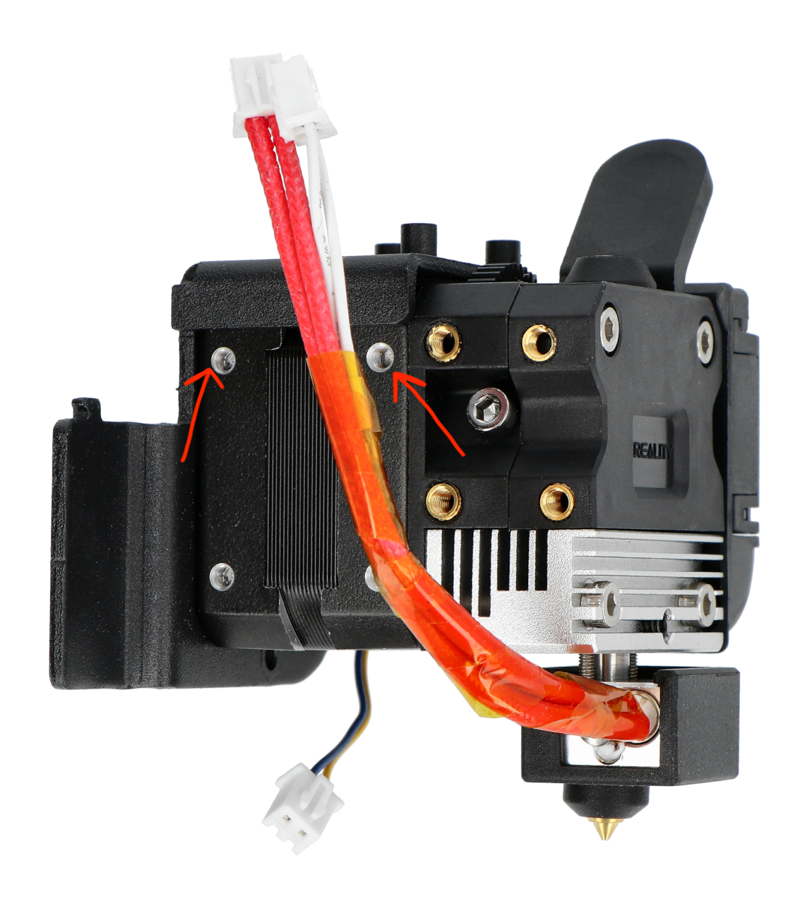
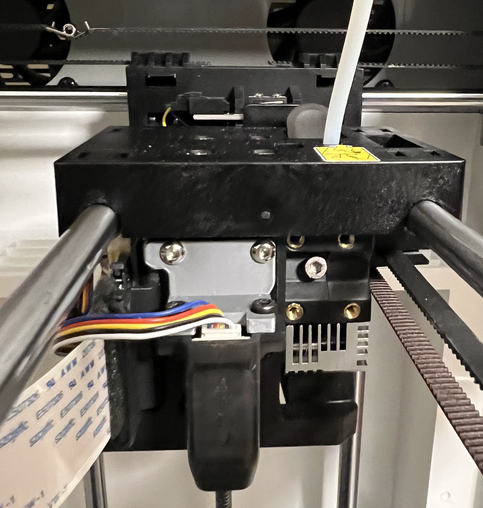
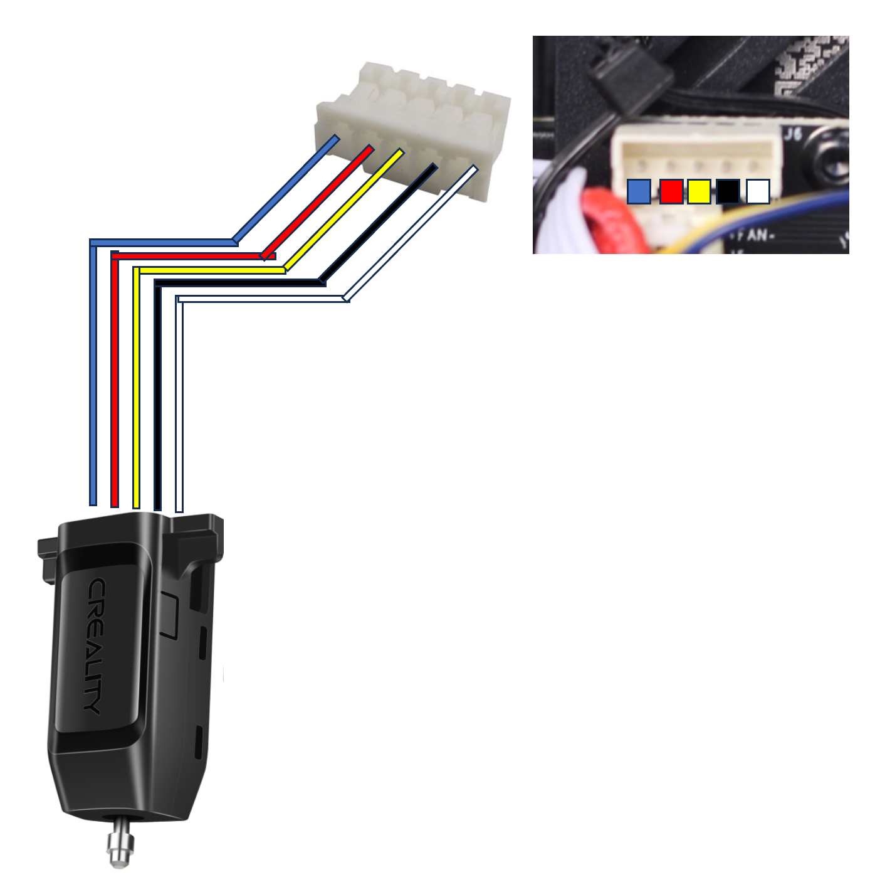

# Sermoon V1 Pro: Klipper and CR-Touch installation guide


## Introduction
This is a guide on how to install Klipper and the CR-Touch sensor on a Sermoon V1 Pro.
I want to create this post to share my recent journey in modding my Sermoon V1 Pro.

What do I cover in this post?
- Installation of Klipper
- Installation of CR-Touch
- Klipper configuration


Note: I have used resources all over the Internet to install Klipper successfully, and I would like to give kudos to every person who provided useful information. 
For this reason, there will be links to Facebook, Internet Archive, GitHub, etc.

Note 2: One of the resources I used was deleted. I managed to fetch back the resource from the Internet archive. However, I later found a post on Reddit referencing that resource, and how that link almost broke their printer. Therefore *use this information here at your own risk*

Disclaimer: **Use this information here at your own risk. Information and instructions are provided without warranty**

My setup:
- Sermoon V1 Pro
- Sermoon V1 Pro "Serial mod". This is described here [https://www.reddit.com/r/Creality_Sermoon_V1/comments/t2sh1t/mod_octoprint_setup_for_the_creality_sermoon_v1/](https://www.reddit.com/r/Creality_Sermoon_V1/comments/t2sh1t/mod_octoprint_setup_for_the_creality_sermoon_v1/)
- I removed/disconnected the Creality wifi box 
- Gigabyte BRIX i5 (very old model, Raspberry PIs were too expensive and I had this in the closet doing nothing)
- BRIX operating system: Ubuntu
- Waveshare 5.5-inch Display Capacitive Touch Screen 1080×1920 Resolution HDMI AMOLED (overkill and expensive, superb quality)

    

## Klipper on Sermoon V1 Pro
Note: Installing Klipper on the Sermoon V1 will make the onboard LCD not work anymore. The printer screen will freeze at the boot sequence with a loading bar. The onboard LCD screen connected to the printer board is not supported by Klipper. I did not investigate this because I already had an HDMI screen (Waveshare) connected to the BRIX which I use as an output and input device (LCD with a touchscreen).

### Installation
Always refer to the official documentation: [https://www.klipper3d.org/Installation.html#building-and-flashing-the-micro-controller](https://www.klipper3d.org/Installation.html#building-and-flashing-the-micro-controller)

#### Installing klipper firmware on Sermoon V1
I performed the firmware configuration and compilation from the BRIX. I then copied the compiled firmware to an SDCARD and put it in the front SDCARD slot of the Sermoon V1.

1. Download Klipper
    ```
    git clone https://github.com/Klipper3d/klipper
    ```
2. Configure Klipper for the Sermoon V1 microcontroller
    ```
    cd ~/klipper/
    make menuconfig
    ```

    I used the following configuration settings:
    - Processor model: STM32F401
    - Bootloader offset: 64KiB
    - Communication interface: Serial (on USART1 PA10/PA9)

3. Quit and save by pressing `q` and then `y`
4. Compile
    ```
    make
    ```

    The compiled file will be saved in this path: klipper/out/klipper.bin

5. Flash the firmware.
    1. I used a different method than the one mentioned on the Klipper website. I did not want to flash the firmware via the serial-USB cable, so I used the SD card.
        ```
        # Copy the compiled firmware into the SDCARD
        cp out/klipper.bin /media/sdcard/firmware.bin
        ```
    2. I inserted the SDCARD in the front SD reader of the Sermoon V1 with the **printer switched off**
    3. I switched on the printer.

        At this point, the printer is updating the firmware. However, the **Creality Sermoon V1 progress bar does not move and stays frozen**. This is expected. I **left the printer in this state for 20 min** for excess of caution to be sure the update process had finished correctly.
    4. I switched off the printer
    5. I Removed the SDCARD

At this point the _Sermoon V1 has the Klipper firmware installed_.🎉🎉🎉

#### Install Klipper service, Moonraker, Mainsail, and KlipperScreen 

I installed the Klipper service from the repo downloaded before [here](#installing-klipper-firmware-on-sermoon-v1):
```
chmod a+x ./klipper/scripts/install-ubuntu-22.04.sh
./klipper/scripts/install-ubuntu-22.04.sh
```
Outcome: You will have Klipper service running. To check (on Ubuntu), issue the following command:
```
sudo systemctl status klipper.service
```
The command should return that the service is enabled and running.


I used [KIAUH](https://github.com/dw-0/kiauh) to install the remaining software component on the BRIX computer. Note that the computer is interfaced with a serial-USB to the printer. This will be the brain of the operation, as the computer interprets the gcode and sends commands to the printer.

KIAUH is a script that facilitates the installation of different software on the computer. I installed the following:
- **Moonraker**: API broker. It will allow you to send commands to the Klipper socket.
- **Mainsail**: Web interface to control the printer (similar to Octoprint).
- **KlipperScreen**: Provides a pretty user interface on the external LCD screen.

```
cd ~
git clone https://github.com/dw-0/kiauh.git
cd kiauh
./kiauh.sh
```

Here are the installation screens:





Follow the guided procedure to install Moonraker, Mainsail, and KlipperScreen selecting the correct numbers.


### Klipper configuration
Klipper configuration is stored in a `printer.cfg`.

1. Copy the example printer.cfg from the Klipper repository folder to your home directory (or directory of your choice).
    ```
    cp ./klipper/config/printer-creality-sermoonV1-2022.cfg ~/printer.cfg
    ```

2. Ensure that the printer.cfg contains the serial ID of your serial-USB connection to the printer. To do that you need to fetch your serial ID with this command:
    ```
    ls /dev/serial/by-id/*
    > /dev/serial/by-id/usb-1a86_USB_Serial-if00-port0
    ```
    Replace/copy the value */dev/serial/by-id/usb-1a86_USB_Serial-if00-port0* in your printer.cfg, in the [mcu] section. You should have something like this:
    ```
    [mcu]
    serial: /dev/serial/by-id/usb-1a86_USB_Serial-if00-port0
    restart_method: command
    ```

3. Make sure that the Klipper service is loading this configuration file. You can change it here:
    ```
    sudo vim /etc/systemd/system/klipper.service
    ```
    Make sure that the configuration file is passed as a parameter of the script, as shown in line 12:
    ```
    #Systemd service file for klipper
    1 [Unit]
    2 Description=Starts klipper on startup
    3 After=network.target
    4
    5 [Install]
    6 WantedBy=multi-user.target
    7
    8 [Service]
    9 Type=simple
    10 User=ubuntu
    11 RemainAfterExit=yes
    12 ExecStart=/home/ubuntu/klippy-env/bin/python /home/ubuntu/klipper/klippy/klippy.py /home/ubuntu/printer.cfg -l /tmp/klippy.log
    ```
4. Reload and restart the services if you change the configuration file parameter
    ```
    sudo systemctl restart klipper.service
    ```

[**Link to my full printer.cfg**](configuration_files/printer.cfg)

[**Link to my full macros.cfg**](configuration_files/macros.cfg)

### Moonraker configuration
Moonraker needs to be connected to the Klipper Linux socket to be able to call Klipper Services APIs.
I used this moonraker configuration:
```
[server]
host: 0.0.0.0
port: 7125
klippy_uds_address: /home/octoprint/printer_data/comms/klippy.sock

[authorization]
trusted_clients:
    127.0.0.1
    10.0.0.0/8
    127.0.0.0/8
    169.254.0.0/16
    172.16.0.0/12
    192.168.0.0/16
    FE80::/10
    ::1/128
cors_domains:
    *.lan
    *.local
    *://localhost
    *://localhost:*
    *://my.mainsail.xyz
    *://app.fluidd.xyz


[octoprint_compat]

[history]

[update_manager]
channel: dev
refresh_interval: 168

[update_manager mainsail]
type: web
channel: stable
repo: mainsail-crew/mainsail
path: ~/mainsail
```
Note: This is not a secure setup, authorization is based on IPs and all local network IPs are authorised. Restrict access and apply security configurations according to your needs.

To check if Moonraker settings are ok, go to your ip: http://<klipper_computer_ip>:7125
You should get something like this:




### Mainsail configuration
This is the front-end to control your printer. Additionally, this will allow us to modify all the configuration files via the browser, including the printer.cfg file. Also, it will allow you to reboot the Klipper service, the Klipper firmware, and the computer where the Klipper service runs.

I used the default config file that was included in the installation.

## CR-Touch
One of the reasons I decided to try Klipper firmware is to have the auto bed levelling feature.

I purchased the CR-Touch from Aliexpress and I followed mainly [this guide](https://web.archive.org/web/20230118011159/https://www.hyperio.ch/blog/creality-sermoon-v1-with-cr-touch-and-klipper.html) **with modifications as it contained some _dangerous misconfigurations_**.

### Hardware installation
I designed a mounting bracket for the CR-touch. Here is the design [https://www.thingiverse.com/thing:6212974](https://www.thingiverse.com/thing\:6212974)

I decided to mount the bracket screwing it in these 2 holes:



The final result is:



### Electronics: wiring diagram
The Sermoon V1 Pro comes already with a "Tocuh" connector for the CR-Touch on the board that is attached to the extruder motor.

I used the cable included in the CR-Touch sensor box, I had to shorten it and crimp a JST PH 2.0 with 5 pins to the end that goes into the Sermoon V1 electronic board on the extruder assembly.

Here is a high-level connection diagram:




### CR-touch Klipper configuration in the file printer.cfg

I used the CR-Touch for homing. This change will disable the end switch at the bottom of the Z-axis. The printer, when homing the Z axes, will use the CR Touch to stop the bed from moving upwards.

I **changed** the section `[stepper_z]` as follows (in printer.cfg):
```
[stepper_z]
...
# The next 2 lines are commented out to disable the endstop switch at the bottom of the Z axis.
#endstop_pin:  PB3
#position_endstop: 165

# added this line to enable the cr-touch as endstop switch.
endstop_pin: probe:z_virtual_endstop
position_max: 165
# This line needs to be negative as it will allow to pass 0 during the Z offset calibration process.
position_min: -3
...
```

I added the `[bed_mesh section]`. Note that the mesh_min and mesh_max need to be calibrated. I followed the instructions in [this video (from minute 3:13)](https://youtu.be/fN_ndWvXGBQ?si=EStIC9ZNfzhZvfCZ&t=193).
```
# section to configure the bed mesh for calibration
[bed_mesh]
speed: 80
horizontal_move_z: 5
mesh_min: 1.5,28.2 # This may need to be calibrated for your printer
mesh_max: 136,168.2 # This may need to be calibrated for your printer
probe_count: 5,5 # This is the number of probing points on the X then Y axes
mesh_pps: 2,2
fade_start: 1
fade_end: 10
fade_target: 0
```
I added the `[bltouch]` and `[safe_z_home]` sections. I originally put z_offset at 5 (because required, otherwise Klipper does not start). To calibrate the z_offset I followed the instructions in [this video (from minute 5:15)](https://youtu.be/fN_ndWvXGBQ?si=wi64qWCPhBVlbd9T&t=315).
```
# Creality CR-Touch sensor support:
[bltouch]
sensor_pin: ^PC2
control_pin: PC3
x_offset: -38.5
y_offset: 28.2
#z_offset: 5 #Run the "paper test" to find your corresponding value.
speed: 5
samples: 1
sample_retract_dist: 3.5
stow_on_each_sample: False
probe_with_touch_mode: True

[safe_z_home]
home_xy_position: 87.5, 87.5
z_hop: 10
z_hop_speed: 5
```


## Reference/links

1. https://www.hyperio.ch/blog/creality-sermoon-v1-with-cr-touch-and-klipper.html, however, this is not available anymore. I was lucky because the link was crawled by the Internet Archive.
[web archive link](http://web.archive.org/web/20230118011159/https://www.hyperio.ch/blog/creality-sermoon-v1-with-cr-touch-and-klipper.html)
2. [https://github.com/Klipper3d/klipper/pull/5621](https://github.com/Klipper3d/klipper/pull/5621) [found in this subreddit](https://www.reddit.com/r/Creality_Sermoon_V1/comments/vptogk/klipper_configuration_file_for_creality_sermoon_v1/)
3. https://github.com/dw-0/kiauh
4. 'BLtouch for any 3D printer - Comprehensive step by step guide' video by Teaching Tech [https://youtu.be/eF060dBEnfs?si=YgDGheapfuSI0P_y](https://youtu.be/eF060dBEnfs?si=YgDGheapfuSI0P_y)
5. 'ABL offset guide including new probe Z offset wizard' video by Teaching Tech [https://youtu.be/eF060dBEnfs?si=YgDGheapfuSI0P_y](https://youtu.be/eF060dBEnfs?si=YgDGheapfuSI0P_y)
6. Facebook group 'Creality Sermoon V1&V1 Pro Fully-enclosed 3D Printer'  [https://www.facebook.com/groups/396759118770043/] (https://www.facebook.com/groups/396759118770043/) 
7. Z-offset explanation video https://www.youtube.com/watch?v=W8ouBPnRV4s
